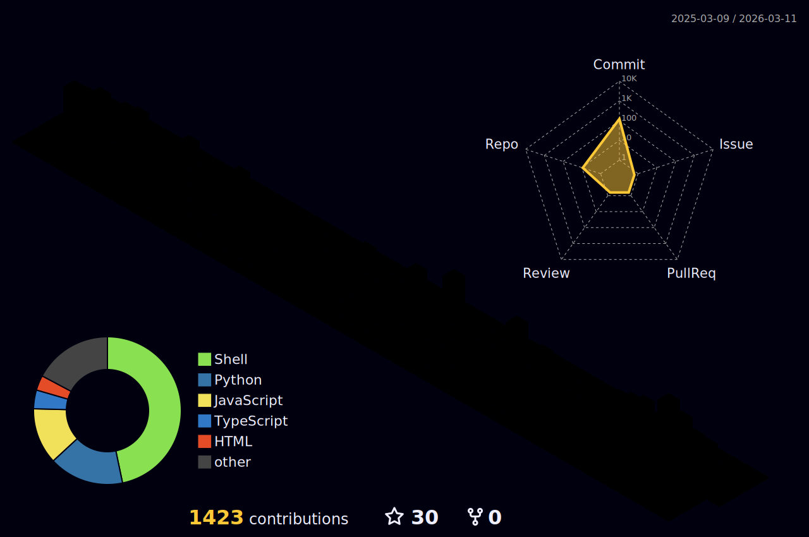

 

<svg fill="none" viewBox="0 0 800 100" width="800" height="100"
    xmlns="http://www.w3.org/2000/svg">
    <foreignObject width="100%" height="100%">
        

            
            

                <h1>
                    

                        Hi👋
                        
                            , I'm Bruno Hoinacki
                        
                    

                </h1>
            

        

    </foreignObject>
</svg>

   <!--  -->
   

<h3 align="center">
 • FullStack Developer •
</h3>

***

### 🎯 About me

Hey there 👋

Nice to meet you! I'm Bruno Hoinacki, a Full Stack Developer with a great passion for technology and innovation. My career in IT began with a curiosity about how things work, which quickly turned into a professional journey full of learning. Over the years, I have specialized in solutions for e-commerce, blogs, websites, and systems, always focusing on quality and efficiency.  

My background includes experience in network administration, computer maintenance, and design, which prepared me for Web Development, where I found my true calling. Today, I am proficient in a wide range of technologies such as Python, Django, PHP, Laravel, Nuxt.js, Vue.js and others, which I use to create diverse, scalable, and innovative solutions. I believe that software development involves both people and code, so I value collaboration and knowledge sharing to overcome challenges.  

My experience as an administrative manager has enhanced my leadership skills, allowing me to effectively guide teams and ensure project quality. Personally.

I am always looking for new connections and opportunities to collaborate with other professionals who are passionate about technology. Let's explore the vast world of IT together and create innovations that truly make a difference.

Want to know more about me? [Check out my website.](https://forcoder.com.br)

***
## 🛠 &nbsp;Tech Stack

### 👩‍💻 &nbsp;Languages

### 🎛️ &nbsp;Libraries & Frameworks

### 💸 &nbsp;Payment Gateways

### ⚡ &nbsp;Database 

### ☁️ &nbsp;Hosting

### 🗄️ &nbsp;Servers

### ⚙️ &nbsp;Terminals

### 🧱 &nbsp;WebSite Builders

### 📚 &nbsp;API Testing

### 🏗️ &nbsp;Containers

### 🎯 &nbsp;Tracking

### 🚀 &nbsp;Versioning Technologies

### 📂 &nbsp;Cloud Storage

### 🎛️ &nbsp;Operating System

### 🤖 &nbsp;Artificial Intelligence and Bots

### 🌐 &nbsp;Browsers

### 🎨 &nbsp;Design Graphic

### 🏢 &nbsp;Office

***
