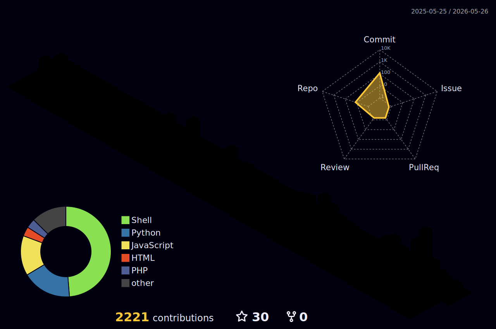

<div align="center">
    
</div>

<div align="center">
   
</div>

<h1 align="center">
Bruno Hoinacki
</h1>

<h3 align="center">
Founder @ Forcoder • CTO @ FunnelMax
</h3>

<h4 align="center">
Senior Full Stack Engineer • DevOps Engineer • Product Builder
</h4>

<div align="center">

<a href="mailto:brunohoinackib@gmail.com">

</a>

<a href="https://www.linkedin.com/in/bruno-hoinacki-035134175/">

</a>

<a href="https://forcoder.com.br">

</a>

<a href="https://links.forcoder.com.br">

</a>

</div>

<div align="center">


</div>

---

# About Me

I'm a Brazilian Software Engineer focused on building digital products, SaaS platforms, cloud infrastructure and scalable systems.

My journey started at 15 years old working with hardware, computer maintenance and networking.

Today I work as:

- Founder at Forcoder
- CTO at FunnelMax
- Full Stack Engineer
- DevOps Engineer
- Product Builder

I design, build and maintain complete digital products, from infrastructure to mobile applications.

---

## Current Roles


Founder and Software Engineer at Forcoder.

Building SaaS products, custom systems, infrastructure and digital businesses.

---


CTO and Software Engineer responsible for:

- Product architecture
- Tracking systems
- Analytics
- DevOps
- Infrastructure
- Product roadmap

---

# Numbers

```text
30+ Delivered Projects
10M+ Transactions Processed
12K+ Customers Served
20+ Production Systems
100+ Containers Running
Multiple SaaS Products
Android & iOS Applications
````

---

# Industries


---

# Journey

| Year | Position                  |
| ---- | ------------------------- |
| 2015 | Hardware & Networks       |
| 2019 | Administrative Management |
| 2022 | Systems Analysis          |
| 2023 | Full Stack Developer      |
| 2024 | DevOps Engineer           |
| 2025 | Founder & CTO             |
| 2026 | Product Engineer          |

---

# Companies


Founder & Senior Software Engineer

---


Product Architecture and DevOps

---


DevOps and Infrastructure

---


Marketplace and Infrastructure

---


Web Systems and Tracking

---

# Products

## Permute-se

Real estate matching platform.

* Android application
* iOS application
* Property matching
* Marketplace
* Payments
* Analytics
* Tracking
* SaaS architecture

---

## FunnelMax

Marketing analytics platform.

* Event tracking
* Funnels
* Attribution
* Redirectors
* Meta Ads
* Google Ads
* Dashboards

---

## Cash In Flow

Financial reconciliation SaaS.

* Marketplace integrations
* Financial dashboards
* Payment reconciliation
* Multi-user architecture

---

## Links Forcoder

Link in bio SaaS.

* Analytics
* Custom domains
* Tracking
* Multiple pages
* Marketing scripts

---

## Forcoder Agendamento

Scheduling platform.

* Appointments
* Teams
* Customers
* Dashboards
* Reports

---

## SetupForcoder

Open source deployment environment.

* Docker
* Traefik
* SSL
* Multi-project
* Shell automation

---

# Featured Projects

## Permute-se

Property matching platform.

* Laravel
* PHP
* Docker
* Redis
* Traefik
* Android
* iOS
* Payments
* Analytics

---

## FunnelMax

Marketing platform.

* Laravel
* Filament
* NextJS
* TypeScript
* Tracking
* Analytics
* Meta Ads
* Google Ads

---

## Cash In Flow

Financial intelligence for marketplaces.

* Mercado Livre
* Mercado Pago
* Laravel
* Filament
* Redis

---

## GMC Bank

Fintech whitelabel platform.

* Asaas
* Pix
* Banking
* Cards
* Transfers

---

## SetupForcoder

Open source deployment stack.

* Docker
* Traefik
* SSL
* Multi-tenant
* VPS

---

# Open Source

* SetupForcoder
* ThingsFinder
* Chess System Java
* Snake Game C
* BHB Eventos
* Angular Blog
* Landing Pages
* Laravel Boilerplates

---

# Current Focus

* SaaS products
* Product engineering
* Cloud infrastructure
* Event tracking
* Laravel ecosystem
* DevOps automation
* Open source
* Mobile applications
* Digital products

---

# Tech Stack

## Backend


---

## Laravel Ecosystem


---

## Frontend


---

## CSS & UI


---

# Mobile Development


---

# DevOps & Infrastructure


---

## Reverse Proxy & Web Servers


---

# Cloud


---

# Operating Systems


---

# Monitoring & Observability


---

# Automation


---

# Databases


---

# CMS & E-commerce


---

# Payments


---

# Marketing & Tracking


---

# APIs & Integrations


---

# AI & Security


---

# Development Tools


---

# Architecture & Engineering

## Architecture Principles

✔ Build software that solves real problems

✔ Keep systems simple and scalable

✔ Infrastructure as code

✔ Automate repetitive tasks

✔ Performance before complexity

✔ Developer experience matters

✔ Monitoring is mandatory

✔ Security by default

✔ Documentation first

✔ Business-driven technology

---

# Areas of Expertise

| Area | Experience |
|------|------------|
| SaaS Platforms | ⭐⭐⭐⭐⭐ |
| DevOps | ⭐⭐⭐⭐⭐ |
| Laravel | ⭐⭐⭐⭐⭐ |
| System Architecture | ⭐⭐⭐⭐⭐ |
| Docker | ⭐⭐⭐⭐⭐ |
| APIs | ⭐⭐⭐⭐⭐ |
| Infrastructure | ⭐⭐⭐⭐⭐ |
| Mobile | ⭐⭐⭐⭐ |
| Python | ⭐⭐⭐⭐ |
| Cloud | ⭐⭐⭐⭐ |
| Marketing Tech | ⭐⭐⭐⭐⭐ |
| Tracking Systems | ⭐⭐⭐⭐⭐ |

---

# What I'm Currently Working On

- Building SaaS platforms
- Product Engineering
- Event Tracking Systems
- Financial Systems
- Marketplace Integrations
- Infrastructure Automation
- Mobile Applications
- Laravel Ecosystem
- Open Source Projects
- Cloud Architecture

---

# Currently Building

### Permute-se

Real estate marketplace.

### FunnelMax

Marketing tracking platform.

### Cash In Flow

Financial reconciliation SaaS.

### Forcoder Agendamento

Scheduling platform.

### SetupForcoder

Open source DevOps environment.

---

# Professional Goals

- Build products that impact businesses.
- Create scalable software.
- Improve developer experience.
- Share knowledge.
- Contribute to open source.
- Build sustainable companies.

---

# GitHub Analytics

<div align="center">


</div>

---

# GitHub Streak

<div align="center">


</div>

---

# Contribution Graph

<div align="center">


</div>

---

# Certifications

- Python for Cloud & Big Data
- Information Systems
- Cybersecurity
- Algorithms and Data Structures
- DevOps Fundamentals
- Docker & Containers
- Linux Administration

---

# Education

🎓 Analysis and Systems Development

🎓 Postgraduate in Cybersecurity

📚 Continuous learning through real-world projects.

---

# Philosophy

Technology is only valuable when it creates impact.

I believe software should:

- solve real problems;
- simplify operations;
- generate measurable results;
- scale sustainably;
- improve people's lives.

The best software is the one users don't need to think about.

---

# Daily Environment

- Ubuntu Linux
- Docker
- PhpStorm
- VSCode
- GitHub
- Cloudflare
- Postman
- Insomnia
- Portainer
- Terminal

---

# Fun Facts

- Started with hardware and maintenance at 15 years old.
- Built multiple production systems.
- Founder of a software company.
- CTO of a SaaS company.
- Passionate about infrastructure.
- Loves automation.
- Linux user.
- Coffee powered.

---

# Contact

<div align="center">

<a href="mailto:brunohoinackib@gmail.com">

</a>

<a href="https://www.linkedin.com/in/bruno-hoinacki-035134175/">

</a>

<a href="https://forcoder.com.br">

</a>

<a href="https://links.forcoder.com.br">

</a>

</div>

---

# Profile Views

<div align="center">


</div>

---

<div align="center">

## Building software that solves real problems.

### Founder @ Forcoder

### CTO @ FunnelMax

### Full Stack Engineer • DevOps • Product Builder

</div>

---

<div align="center">



</div>

---

<div align="center">

⭐ From Bruno Hoinacki

</div>
