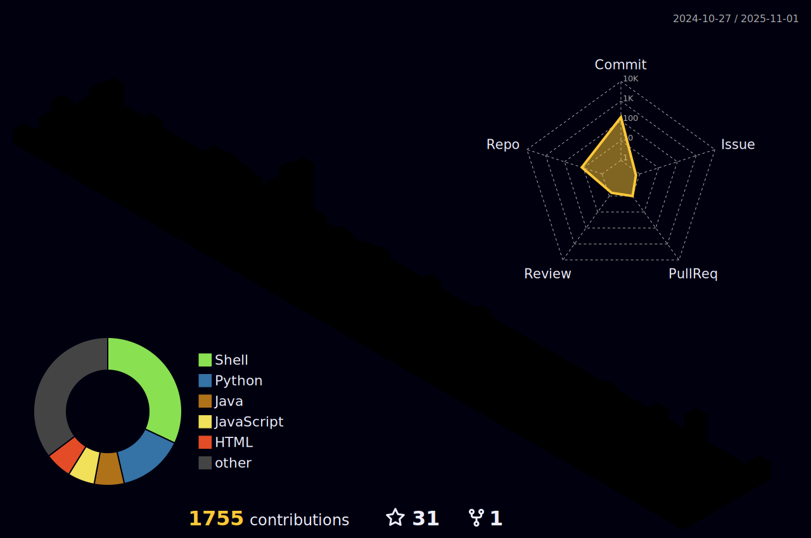

    

   

<h2 align="center">
 🚀 Senior Full Stack Developer | DevOps Engineer 🚀
</h2>

---

## 🎯 About Me

### Hey there! 👋 Welcome to my tech universe!

I'm **Bruno Hoinacki**, a **Senior Full Stack Developer** and **DevOps Engineer** with **5+ years of experience** transforming ideas into scalable and efficient technological solutions. My passion for technology started at 15 working with hardware and networks, and today it materializes in robust architectures and elegant code.

### 🎯 **Core Expertise**
- **Backend:** PHP/Laravel (specialist), Python/Django
- **Frontend:** JavaScript, Vue.js, Nuxt.js, Angular  
- **DevOps:** Docker, CI/CD, Automation, Observability
- **Cloud:** AWS, Cloudflare, DigitalOcean, Contabo
- **Infrastructure:** Grafana, Prometheus, Nginx, Apache

### 💼 **Experience That Makes a Difference**
With a background in **administrative management**, I bring a unique perspective that combines leadership, organization, and technical excellence. This experience allows me not only to develop solutions but also to lead teams and deliver projects that truly impact businesses.

### 🚀 **My Mission**
Create **software and infrastructure** that make a difference, supporting people and companies to overcome challenges through technological innovation. I believe the best technology is the one that solves real problems elegantly and efficiently.

**Let's connect?** [Learn more about me here!](https://links.forcoder.com.br)

---

## 🛠 **Tech Stack**

### 🌟 Core Technologies

---

### 🔧 DevOps & Infrastructure

---

### 📊 Monitoring & Automation

---

### 🗄️ Databases

---

### 🎨 Frontend & UI

---

### 💸 Payments & Integrations

---

### 📚 API & Testing

---

### 🤖 AI, Data & Security

---

### ⚙️ Productivity & Tools

---

## 📊 **GitHub Analytics**

  
  

---

## 🚀 **Current Focus**

- 🔭 Working on **scalable e-commerce solutions** and **enterprise systems**
- 🌱 Deepening knowledge in **AWS architecture** and **advanced DevOps practices**
- 👯 Looking to collaborate on **open source projects** and **innovative startups**
- 💬 Ask me about **Laravel**, **Vue.js**, **DevOps**, **System Architecture**
- ⚡ Fun fact: Started with hardware at 15, now building digital experiences!

---

## 📫 **Let's Connect!**

---

  

---

  <i>⭐️ From <a href="https://github.com/brunohoinacki">brunohoinacki</a> with ❤️</i>

